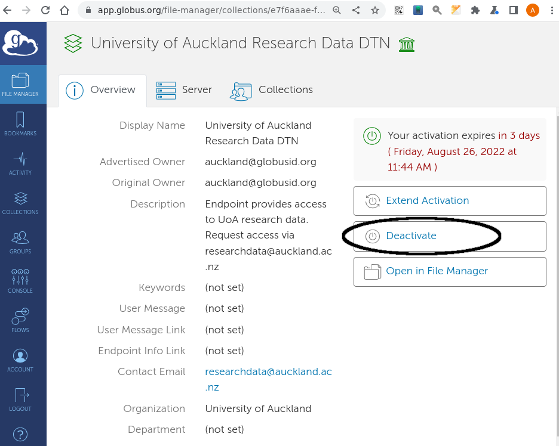

# Contents
  - [Globus Research Drive Access](#globus-research-drive-access)
  - [Transfer Errors](#transfer-errors)
  - [Endpoint management](#endpoint-management)
  - [Performance](#performance)

---

**NOTE**

* As of Dec 8, 2021, the NeSI data transfer node `NeSI Wellington DTN` has been deactivated,
* A new endpoint called `NeSI Wellington DTN V5` is available in its place.[^1]

---


* You can use [globus](globus.org) to transfer data between your research drive and NeSI (or other public globus endpoints):
[NeSI documentation](https://support.nesi.org.nz/hc/en-gb/articles/4409792460815-New-Globus-endpoint-makes-it-easier-to-transfer-large-data-sets-to-from-NeSI-HPC-Platform).

* You can create a personal endpoint on your Nectar vm and transfer data between your research drive and your nectar vm:
[Nectar vm data-transfers](./ntr-drive.html)

   

## Globus Research Drive Access

If you want Globus to access your research drive, please [submit a research-drive request](https://eresearch-dashboard.auckland.ac.nz/service/research-storage/request), specifying "existing" storage, and providing
1. the name of your research drive
2. the usernames (UPI) of those on your team who need globus access to this drive


   

## Transfer Errors

You can inspect the logs for your globus transfers from the console
in globus:

1.  Select the Activity tab on the LHS of the globus
page and then select the job that you want to investigate. {:width="900px"}

2. Select the Event Log tab
(highlighted) and view the Fault Events for that job.  You may be able
to see the problem with your transfer here.  If this raises issues you
can't control, please get in touch with Centre for eResearch. {:width="900px"}

   

## Endpoint management

Occasionally you may attempt to transfer files to/from your research drive,
and the drive appears empty.
The computer that the globus endpoint `University of Auckland Research Data DTN` runs from is occasionally
restarted, and that may cause your research-drive to appear empty when you browse your drive from globus.

In this case, deactivate that endpoint `University of Auckland Research Data DTN`
by 
1. selecting [the endpoint's details page](https://app.globus.org/file-manager/collections/e7f6aaae-fe52-11e8-9345-0e3d676669f4/overview)
, and from there:
2. de-activate the endpoint
3. re-activate the endpoint

| endpoint overview             |  deactivate              | reactivate                         |
:------------------------------:|:------------------------:|:-----------------------------------:
  |    |    |  

Now your files should be visible.

   

## Performance

From https://portal.xsede.org/data-management:

>
Beyond the capabilities
of the network and storage systems involved, the single biggest factor
in your transfer performance will be the size of the files being
transferred, as there is time spent on the network setting up and
tearing down the connection for each file transfer, and for high
bandwidth networks like XSEDE this is relatively costly. For example,
going from file sizes of 10MB to 1GB can improve your average transfer
performance from a few MB/sec to over 1GB/sec. If you need to transfer
a large number of files you will get the best performance by first
bundling them into a single tar file and copying the single file.

### Archive (bundle) your files prior to transfer

```bash
cd <name_of_directory_containing_files>/..
tar czvf <bundle_name>.tar.gz <name_of_directory_containing_files>/
```
now transfer the file `<bundle_name>.tar.gz`

### Unpack your files after transfer

```bash
tar xzvf <bundle_name>.tar.gz  #extract into directory named <name_of_directory_containing_files>
```


 


## Further Reading

* [further globus documentation](https://uoa-eresearch.github.io/vmhandbook/doc/drive-globus.html)
* [Personal Globus Endpoint Configuration](https://support.nesi.org.nz/hc/en-gb/articles/360000217915)

## Footnotes
[^1]: This is due to an [upgrade of the underlying endpoint software to Globus 5](https://support.nesi.org.nz/hc/en-gb/articles/4405623380751-Data-Transfer-using-Globus-V5).


