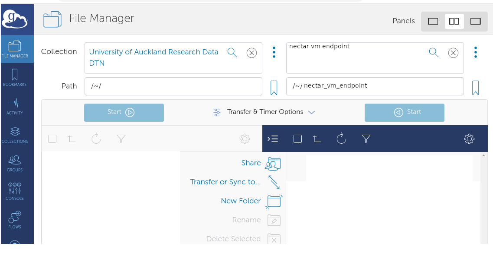

# Contents
  - [Research Drive Configuration](#research-drive-configuration)
  - [Nectar VM Configuration](#nectar-vm-configuration)
  - [Globus Data Transfers](#globus-data-transfers)

---

Nectar vms are located, by default, outside the University of Auckland firewall, 
and your research drive is inside that firewall.  
For that reason, you cannot currently mount your research drive on a nectar vm.

But the University operates a globus data-transfer node [Auckland Research Data DTN](https://support.nesi.org.nz/hc/en-gb/articles/360000931775)
outside the firewall giving you access to your research-drive from there.

In order to transfer files between your nectar instance and your research drive using globus, follow the following steps:
You can use [globus](globus.org) to transfer data between your research drive and any nectar vm.
This requires configuration on both the research-drive and your nectar vm.

## Research-drive configuration

Request [access for globus to see your research-drive](./drive-globus.html#research-drive-access)

## Nectar vm configuration

Install a [globus personal endpoint](https://docs.globus.org/how-to/) on your nectar vm.
This installation is specific to the vm's operating system.  Choose appropriately.

   
## Globus Data Transfers

With both your research-drive and nectar vm now configured to be accessible through globus,

1. start the globus personal connect application on your nectar vm (see the installation page 
[globus personal endpoint](https://docs.globus.org/how-to/) for a fully-worked example).
2. in your browser, sign in to [globus](globus.org) selecting the "existing organizational login" associated with University of Auckland (single-sign-on).
3. Proceed to globus's [FileManager](https://app.globus.org/file-manager) page, and select
the two endpoints you want to connect:
* For your research drive:  enter "Auckland" in the Collection Search bar, and select `Auckland Research Data DTN`.
Authenticate, and your research drive will be visible.
* For your nectar vm: under the "Your Collections" tab, select the personal globus endpoint on your nectar vm.
 {:width="650px"}
 {:width="650px"}
4. Navigate to the location of your source and target directories, and proceed to transfer files.

## Further Reading

* [further globus documentation](https://uoa-eresearch.github.io/vmhandbook/doc/drive-globus.html)
* [Personal Globus Endpoint Configuration](https://support.nesi.org.nz/hc/en-gb/articles/360000217915)

