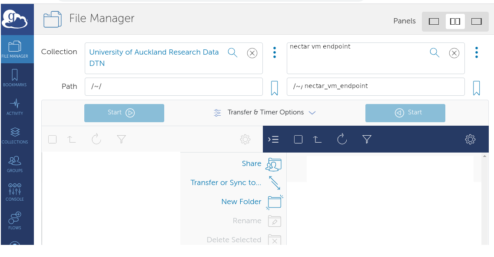

# Contents
  - [Research Drive Configuration](#research-drive-configuration)
  - [Nectar VM Configuration](#nectar-vm-configuration)
  - [Globus Data Transfers](#globus-data-transfers)

---

Nectar virtual machines (VMs) are located, by default, outside the University of Auckland firewall, 
and your research drive is inside that firewall. 
For that reason, you generally cannot mount your research drive on a Nectar VM.

The University operates a [Globus](https://globus.org) data-transfer node, the [University of Auckland Research Data Collection](https://app.globus.org/file-manager?origin_id=844ba90c-1d37-4480-8263-a206ebd9f4f3), outside the firewall, giving you access to your research drive from there.
Globus provides one of the fastest ways to transfer large amounts of data.

Transferring files between a Nectar instance and your research drive using Globus
requires configuration on both the research drive and your Nectar instance:

### Research drive configuration

[Submit a research drive request](https://eresearch-dashboard.auckland.ac.nz/service/research-storage/request), specifying "existing" storage, and provide the University of Auckland usernames (UPIs) of those on your team who need Globus access to this drive.

### Nectar VM configuration

Install a [Globus personal endpoint](https://www.globus.org/globus-connect-personal)
on your Nectar VM.
This installation is specific to the VM's operating system. Choose appropriately.

   
## Globus Data Transfers

With both your research drive and Nectar VM now configured to be accessible through Globus,

1. Start the Globus personal connect application on your Nectar VM. See the download page 
for your operating system (Windows/MacOS/Linux) for a fully-worked example.
2. In your browser, sign in to [Globus](https://globus.org), selecting the "existing organizational login" 
associated with `The University of Auckland` (single-sign-on).
3. Proceed to Globus's [FileManager](https://app.globus.org/file-manager) page, and select
the two endpoints you want to connect:
* For your research drive: enter "University of Auckland Research Data Collection" in the Collection Search bar, and select it. 
Authenticate, and your research drive will be visible.
* For your Nectar VM: under the "Your Collections" tab, select the personal Globus endpoint on your Nectar VM.
 {:width="650px"}
 {:width="650px"}
4. Navigate to the location of your source and target directories, and proceed to transfer files.

## Further Reading

* [further globus documentation](https://uoa-eresearch.github.io/vmhandbook/doc/drive-globus.html)
* [Personal Globus Endpoint Configuration](https://support.nesi.org.nz/hc/en-gb/articles/360000217915)

